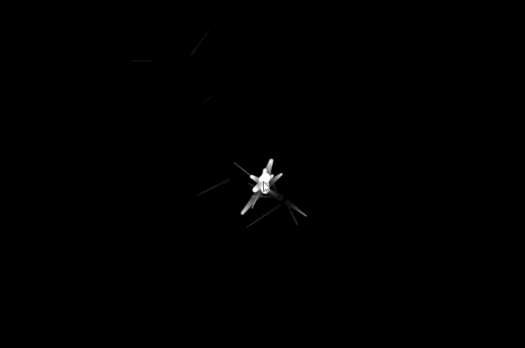

# Particle Explosion Cursor

A lightweight JavaScript effect that creates an **explosion of particles** at the cursor position when clicked. Perfect for adding interactive flair to websites, landing pages, and creative projects.

---

## 🚀 Demo



---

## ✨ Features

- Particle explosion triggered by mouse clicks  
- Configurable particle count, size, color, speed, and lifetime  
- Smooth animations using `requestAnimationFrame`  
- Pure JavaScript – no external dependencies  
- Easy to integrate into any web project  

---

## 📦 Installation

Clone the repository:

```bash
git clone https://github.com/bilalpiaic/Particle-Explosion-Cursor.git
cd Particle-Explosion-Cursor
````

Open `index.html` in your browser to see the demo.

---

## 🔧 Usage

Include the script in your HTML:

```html
<script src="particle-explosion.js"></script>
```

Initialize the effect:

```html
<script>
  ParticleExplosionCursor.init({
    container: document.body,
    particleCount: 40,
    colors: ['#ff4757', '#1e90ff', '#2ed573'],
    maxSpeed: 5,
    size: 3,
    lifeSpan: 1200
  });
</script>
```

---

## ⚙️ Configuration

| Option          | Type         | Default         | Description                                 |
| --------------- | ------------ | --------------- | ------------------------------------------- |
| `container`     | `DOMElement` | `document.body` | Element where the effect will be applied    |
| `particleCount` | `number`     | `30`            | Number of particles emitted per click       |
| `colors`        | `string[]`   | `['#ffffff']`   | Array of colors for the particles           |
| `maxSpeed`      | `number`     | `4`             | Maximum speed (pixels/frame)                |
| `size`          | `number`     | `2`             | Size of each particle                       |
| `lifeSpan`      | `number`     | `800` (ms)      | How long particles last before disappearing |

---

## 📂 File Structure

```
Particle-Explosion-Cursor/
│
├── index.html              # Demo page
├── particle-explosion.js   # Core script
├── style.css               # Optional styling
└── README.md               # Project documentation
```

---

## 🛠 How It Works

1. Listens for mouse click events on the container.
2. Spawns `particleCount` particles at the cursor position.
3. Each particle gets a random direction, velocity, color, and lifetime.
4. The animation loop updates particle positions until they fade out.

---

## 🌍 Browser Support

* ✅ Chrome
* ✅ Firefox
* ✅ Safari
* ✅ Edge

> For best performance, avoid extremely high particle counts on low-end devices.

---

## 📌 Roadmap

* [ ] Support touch devices (mobile/tablet)
* [ ] Add particle physics (gravity, bounce, trails)
* [ ] Configurable shapes (squares, stars, emojis)
* [ ] NPM package support

---

## 🤝 Contributing

Contributions are welcome!

1. Fork the repo
2. Create a branch (`git checkout -b feature-name`)
3. Commit changes (`git commit -m "Add feature"`)
4. Push to branch (`git push origin feature-name`)
5. Open a Pull Request

---

## 📜 License

This project is licensed under the **MIT License**.
See the [LICENSE](LICENSE) file for details.

---

## 🙌 Acknowledgments

Inspired by open-source particle explosion effects and creative cursor animations.

